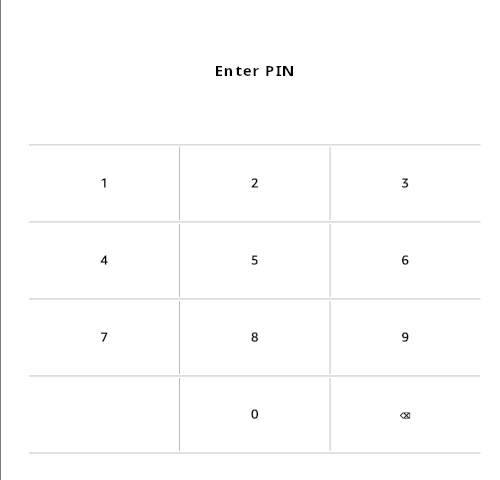

# ScreenLockPin — A Simple PIN Lock for KOReader

**ScreenLockPin** adds a fast, minimal PIN lock screen
to [KOReader](https://github.com/koreader/koreader), helping you protect your
privacy.

---

## ✨ Features

Just what you'd expect from a PIN lock screen 😅

- 🗽 **Flexible PIN length** — supports 4–8 digits
- 🚀 **Lock on boot** — secures your device on KOReader boot (configurable)
- 🔁 **Lock on wakeup** — secures your device after sleep (configurable)
- 🔒 **Full-screen lock** — hides content for privacy
- ⚡ **Instant unlock** — immediate response, no extra confirmation button
- 🚥 **Rate Limiting** — short delay after repeated failed attempts
- 🪶 **Lightweight design** — minimal overhead

---

## 💡 Not a Feature

- This plugin is designed for **privacy and casual protection**, not
  cryptographic security.

---

## 📦 Installation

1. Download the
   [latest release](https://github.com/oleasteo/koreader-screenlockpin/releases/latest);
   either archive is fine — whatever you're familiar with.
2. Extract the archive and copy the extracted folder `screenlockpin.koplugin`
   into KOReader’s `plugins` directory.
3. Restart KOReader. The plugin will appear in the *Screen* submenu.

---

## ⚙️ Usage

The default PIN is `0000`

1. Open KOReader’s *Screen* › **Lock screen** menu.
2. Update your PIN (4-8 digits) and configure plugin options to your liking.
3. Depending on your settings, the Lock Screen will now appear when booting
   KOReader and / or when waking up from sleep mode.

For the lock on wakeup, we use the *Screen* › *Sleep screen* › *Wallpaper* ›
**Postpone screen update after wake-up** setting. Changing this setting will
disable the lock on wakeup feature.

### Recover KOReader without PIN

In case you lost your PIN:

- If you don't have *lock on boot* enabled, a hard reboot should suffice to get
  you into the KOReader. Change your PIN from there.
- If you do have *lock on boot* enabled, you'll need to modify the plugin files.
  Edit the *settings.reader.lua* file inside the *koreader* directory on your
  device. Find the `screenlockpin_pin` option and change if needed. Save and
  reboot KOReader.

---

## 🧩 Compatibility

Designed for and tested with **KOReader v2025.08**. Please report any
compatibility issues for this version or newer.

---

## 🧑‍💻 Contributing

Contributions and suggestions are welcome!  
Feel free to open an **issue** or **pull request** to improve functionality,
style, or compatibility.

---

## 📜 License

MIT License —
see [LICENSE](https://github.com/oleasteo/koreader-screenlockpin/blob/main/LICENSE)
for details.
